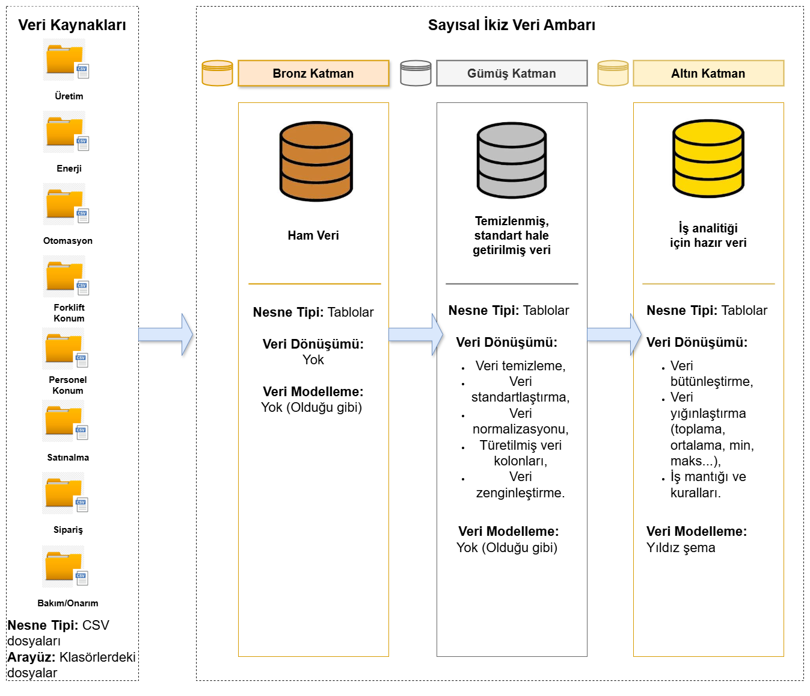

# Digital Twin

## 🎉 Project Digital Twin

Project aims at integrating various data sources in a manufacturing industry setting and is intended to be used as a Strategic Decision Making tool for business users such as mid and high level managers as well as C-Suite members. Digital twin is fundamentally a dashboard tool, customised to the specific needs of the industry. It enables users to generate periodic (daily, weekly, monthly, quarterly) and parametric reports to derive actionable insights without needing to examine the dashboard. 
Data warehouse refresh interval is daily.
Number and variety of data sources can be increased as needed.

Data sources are;

1. Production data, Table type: Transactional data, Data Source: ERP,
2. Real Time Location Services data for personnel locations, Table type : Time-series data, Data source : IoT devices,
3. Real Time Location Services data for forklift locations, Table type : Time-series data, Data source : IoT devices,
4. Electricity consumption data, Table type : Time-series data, Data source : IoT devices,
5. SCADA measurement data, Table type : Time-series data, Data source : Relevant SCADA systems,
6. Maintenance and machine failures data, Table type : Transactional data, Data source : ERP,
7. Customer orders data, Table type : Transactional data, Data source : ERP,
8. Purchase orders data, Table type : Transactional data, Data source : ERP.

---
## 🏗️ Data Architecture

The data architecture for this project follows Medallion Architecture **Bronze**, **Silver**, and **Gold** layers:

1. **Bronze Layer**: Stores raw data as-is from the source systems. Data is ingested from IoT sensor, SCADA and ERP API's and/or CSV files into SQL Server Database.
2. **Silver Layer**: This layer includes data cleansing, standardization, and normalization processes to prepare data for analysis.
3. **Gold Layer**: Houses business-ready data modeled into a star schema required for reporting and analytics.

---
## 📖 Project Overview

This project involves:

1. **Data Architecture**: Designing a Data Warehouse Using Medallion Architecture **Bronze**, **Silver**, and **Gold** layers.
2. **ETL Pipelines**: Extracting, Transforming, and Loading data from source systems into the warehouse.
3. **Data Modeling**: Developing fact and dimension tables optimized for analytical queries.
4. **Analytics & Reporting**: Relevant Python libraries such as Pandas, Numpy, Plotly, Dash is used for analytics & reporting part of the project.
   
---
## 🚀 Project Requirements

### Building the Data Warehouse (Data Engineering)

#### Objective
Develop a data warehouse using SQL Server to consolidate sales data, enabling analytical reporting and informed decision-making.

#### Specifications
- **Data Sources**: Import data from multiple sources (ERP, SCADA, IoT sensors) provided as CSV files.
- **Data Quality**: Cleanse and resolve data quality issues prior to analysis.
- **Integration**: Combine both sources into a single, user-friendly data model designed for analytical queries.
- **Scope**: Focus on the latest dataset only; historization of data is required.
- **Documentation**: Provide clear documentation of the data model to support both business stakeholders and analytics teams.
---

### BI: Analytics & Reporting (Data Analysis)

#### Objective
Develop SQL-based analytics to deliver detailed insights into:
- **Production Analytics**
- **Production analytics in conjunction with energy consumption**
- **Production analytics in conjunction with SCADA measurements**
- **Time intelligence analytics (including seasonality, trends)**
- **Personell productivity analytics in conjunction with production analytics**
- **Forklift productivity analytics in conjunction with production analytics**
- **Maintenance & Downtime metrics analytics**

These insights empower stakeholders with key business metrics, enabling strategic decision-making.  

